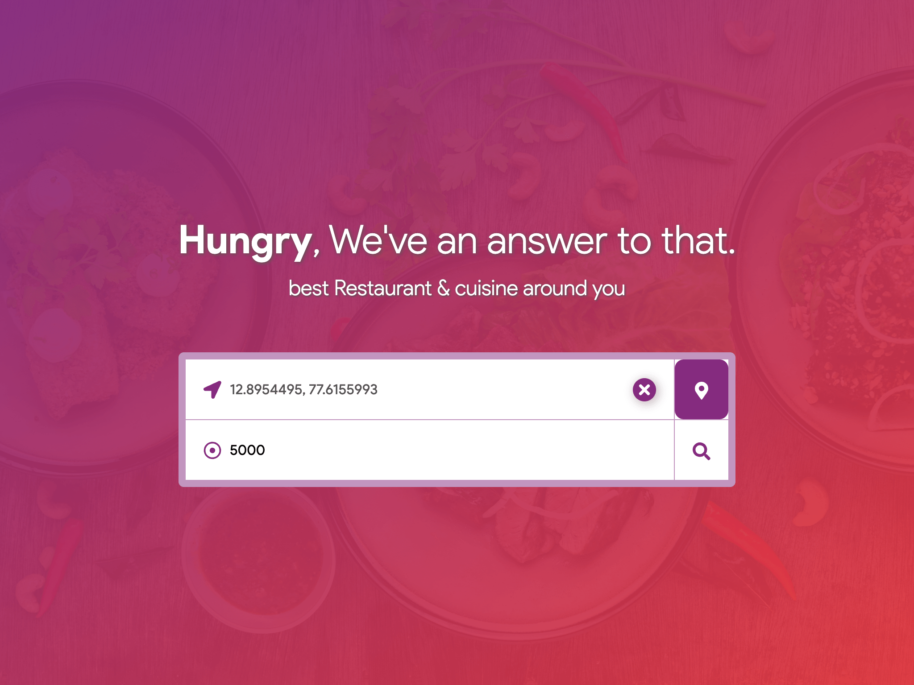

# Restaurant Finder 🍽️

Restaurant Finder is a React application that helps users discover the best restaurants and cuisines around them. It allows users to search based on either geographic coordinates or specific locations, leveraging the power of the Google Places API. If a Google Places API Key is not provided, the app uses **Faker.js** to generate random restaurant data for testing and demo purposes.

## Features ✨

- **Location-based Search**: Enter coordinates or search by a location name (e.g., HSR Layout) to find nearby restaurants.
- **Google Places API Integration**: Get real-time data on restaurants, their ratings, and other key details.
- **Faker.js for Mock Data**: Don't have an API key? No problem! The app generates realistic restaurant data using Faker.js.
- **Custom Sorting**: View restaurants sorted by ratings, proximity, and more.
- **Responsive Design**: The app works seamlessly across devices with a clean and user-friendly interface.

## Screenshots 📸

### Home Search



### Search Results


## Installation ⚙️

1. Clone the repository:

   ```bash
   git clone https://github.com/nikhilsindhu/restro-finder.git
   cd restro-finder
   ```

2. Install dependencies:

   ```bash
   npm install
   ```

3. Add your Google Places API Key:

   - Create a `.env` file at the root of your project.
   - Add the following line to the `.env` file:
     ```bash
     REACT_APP_GOOGLE_API_KEY=your_api_key_here
     ```

4. Run the app:

   ```bash
   npm start
   ```

5. Open [http://localhost:3000](http://localhost:3000) to view the app in your browser.

## Usage 🛠️

1. Enter your current location using either:
   - Geo coordinates (latitude, longitude), or
   - A specific location (e.g., 2nd Cross Road, HSR Layout)
2. Click the search button.
3. View restaurants around you, sorted by reviews.

## Technology Stack 🧑‍💻

- **Frontend**: React, JavaScript
- **API**: Google Places API, Faker.js (for mock data)
- **Styling**: SCSS

## Contributing 🤝

Contributions, issues, and feature requests are welcome! Feel free to check out the [issues page](https://github.com/yourusername/restaurant-finder/issues).

## License 📜

This project is licensed under the MIT License - see the [LICENSE](LICENSE) file for details.
